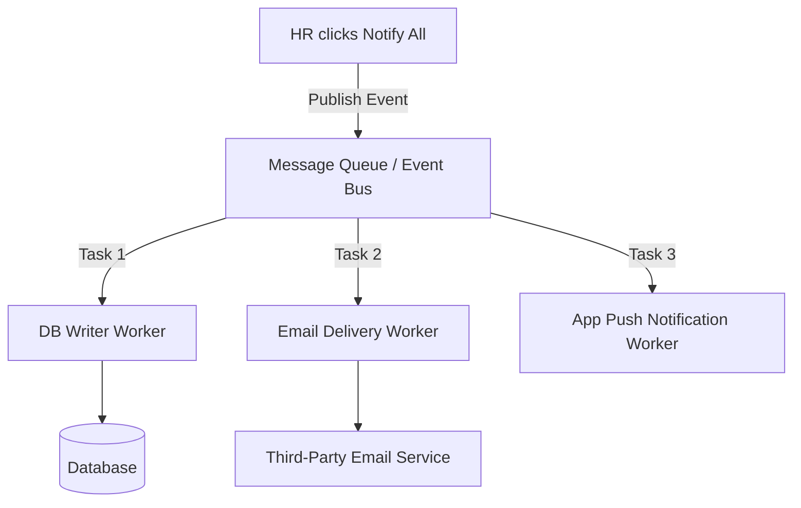

# Stage 1 - API Design

## 1. Logging Middleware API

- Endpoint: `POST /evaluation-service/logs`
- Header: `Authorization: Bearer <token>`
- Content-Type: `application/json`

Request Body:

```json
{
	"stack": "backend",
	"level": "info",
	"package": "service",
	"message": "notification fetched"
}
```

Success Response:

```json
{
	"logID": "16d73cdf-02c5-4769-9613-8f771349af9c",
	"message": "log created successfully"
}
```

## 2. Notification Consumption API

- Endpoint: `GET /evaluation-service/notifications`
- Header: `Authorization: Bearer <token>`
- Query: `?page=1&limit=10&type=Placement&isRead=false`

Expected fields per notification:

- `id`
- `userId`
- `type` (Placement | Result | Event)
- `title`
- `message`
- `isRead`
- `createdAt`

## 3. Priority Inbox API (App side)

- Endpoint: `GET /api/priority-inbox?limit=10`
- Input source: notification API payload
- Output: top 10 sorted by priority and recency

# Stage 2 - MongoDB Design

## Collections

### users

- `_id` (ObjectId)
- `name` (String)
- `email` (String, unique)
- `rollNo` (String, unique)
- `createdAt` (Date)

### notifications

- `_id` (ObjectId)
- `userId` (ObjectId, ref users)
- `type` (String enum: Placement, Result, Event)
- `title` (String)
- `message` (String)
- `isRead` (Boolean, default false)
- `priorityScore` (Number)
- `createdAt` (Date)

## Indexes

- `{ userId: 1, isRead: 1, createdAt: -1 }`
- `{ userId: 1, type: 1, createdAt: -1 }`
- `{ createdAt: -1 }`

# Stage 3 - Query Optimization

## Query Review & Accuracy

The query provided:
```sql
SELECT * FROM notifications 
WHERE studentID = 1042 AND isRead = false 
ORDER BY createdAt ASC;
```

### 1. Accuracy & Potential Issues
- **Ascending vs Descending Sort**: Sorting by `createdAt ASC` displays the oldest notifications first. Typically, inboxes display the newest notifications first (`createdAt DESC`). This sort order should be verified against business requirements.
- **Select Star (`SELECT *`)**: Retrieving all columns (including large message payloads or raw data) increases memory overhead on the database server, buffer pool pressure, and network serialization costs.

### 2. Performance Analysis (Why is it slow?)
- **Full Table Scan / High Search Cost**: With 5,000,000 notifications, if there is no index on `studentID` and `isRead`, the database must scan all 5,000,000 rows (a full-table scan) to filter for student 1042.
- **Sorting Cost**: Even if an index is present on `studentID`, sorting the filtered rows by `createdAt` forces the database to perform an in-memory or on-disk sort (filesort) if the index does not match the sort order.

### 3. Optimization Strategy & Cost
We should define a composite index on the query's filter and sort criteria:
```sql
CREATE INDEX idx_notifications_student_unread_created 
ON notifications (studentID, isRead, createdAt DESC);
```

**Computation Cost Comparison:**
- **Without Index**: Time complexity `O(R + M log M)` where `R` is the total rows in the table (5,000,000) and `M` is the number of matching notifications to sort.
- **With Compound Index**: Time complexity `O(log R + P)` where `P` is the pagination limit (e.g., 10). The lookup is logarithmic (`O(log R)`), and since the index is pre-ordered, the sorting cost is `O(1)`.

### 4. Evaluation of "Index on Every Column" Advice
This advice is **ineffective and highly discouraged** for the following reasons:
1. **Write Performance Penalty**: Every `INSERT`, `UPDATE`, or `DELETE` requires updating all indexes, drastically reducing write throughput.
2. **Storage Overhead**: Indexes occupy significant memory and disk space. Indexing every column could cause index size to exceed the actual table data size.
3. **Single vs Composite Indexes**: The database optimizer can generally only use one index per table access for this query. Separate single-column indexes on `studentID`, `isRead`, and `createdAt` will not prevent index-merges or sorting overhead. A compound index is far superior.

---

## Placement Notifications (Last 7 Days Query)

Query to find all distinct students who received a `Placement` notification in the last 7 days:
```sql
SELECT DISTINCT studentID
FROM notifications
WHERE notificationType = 'Placement'
  AND createdAt >= NOW() - INTERVAL '7 days';
```

---

# Stage 4 - Scaling and Reducing DB Load

## Suggested Solutions

To address the database overwhelm caused by fetching notifications on every page load, we propose three key strategies:

### 1. Redis Caching (Read-Through Cache)
Store the active/unread notifications for each student in Redis (e.g., using a Sorted Set `zset` scored by timestamp or serialized JSON string).
- **Tradeoffs**:
  - *Pros*: Extremely low read latency (<1ms), database queries drop to near-zero for active sessions.
  - *Cons*: Requires cache invalidation strategy. When a new notification arrives or a user marks a message as read, the cache must be updated or evicted.

### 2. Push-Based Architecture (WebSockets / SSE)
Maintain a persistent connection with the client. When a notification is generated, push it directly to active clients without polling.
- **Tradeoffs**:
  - *Pros*: Eliminates page-load fetch overhead and polling. True real-time delivery.
  - *Cons*: High memory/connection footprint on servers. Requires connection tracking and fallback mechanisms for offline users.

### 3. Client-Side HTTP Caching (Conditional GET / ETag)
Use `ETag` headers or `Last-Modified` timestamps. When the client reloads the page, it sends an `If-None-Match` or `If-Modified-Since` request.
- **Tradeoffs**:
  - *Pros*: Saves bandwidth and response rendering time.
  - *Cons*: The server still has to run a lightweight check to determine if the user has new notifications.

---

# Stage 5 - Delivery Reliability & Decoupling

## Shortcomings in the Synchronous Implementation
1. **Linear Latency (Blocking Loop)**: In the synchronous loop, if sending an email takes `100ms`, sending 50,000 emails will take `5,000 seconds (~1.38 hours)`. The execution will likely time out or crash.
2. **Failure Handling (Midway Crash)**: If the loop fails for 200 students midway, there is no state tracking. We do not know where to resume, leading to either double-delivery or missing notifications.
3. **Coupled Failures**: If the email service is down, the entire loop is blocked, postponing database writes and app pushes.

## DB writes and Email Decoupling
**No, they should not happen together.**
- Database inserts are fast, local, and reliable.
- Email API requests are slow, external, and rate-limited.
- Decoupling them using a Message Queue ensures that database writes complete instantly, and emails are processed asynchronously by separate consumers.

## Redesigned Architecture (Asynchronous Workers)



## Revised Pseudocode (Message Queue Producer/Consumer)

```javascript
// Producer: Enqueue task quickly
function notify_all(student_ids, message) {
  const payload = {
    studentIds: student_ids,
    message: message,
    timestamp: new Date().toISOString()
  };
  
  // Publish a bulk notification event to the Message Queue
  MessageQueue.publish("notification.broadcast", payload);
}

// Consumer: DB Writer
Queue.subscribe("notification.broadcast", async (event) => {
  const { studentIds, message } = event;
  // Perform bulk insert
  await db.notifications.bulkInsert(
    studentIds.map(id => ({ studentID: id, message, isRead: false }))
  );
});

// Consumer: Email Dispatcher (Runs in concurrent workers)
Queue.subscribe("notification.broadcast", async (event) => {
  const { studentIds, message } = event;
  
  for (const studentId of studentIds) {
    // Publish individual email job for retry granularity
    MessageQueue.publish("email.send", { studentId, message });
  }
});

// Consumer: Individual Email Sender with Retries
Queue.subscribe("email.send", async (job) => {
  const { studentId, message } = job;
  try {
    await send_email(studentId, message);
  } catch (error) {
    // If it fails, retry with exponential backoff.
    // Move to Dead Letter Queue (DLQ) after max retries.
    await Queue.retryWithBackoff(job, error);
  }
});
```

---

# Stage 6 - Priority Inbox Algorithm

## Explanation of Approach

Maintaining the top `N` notifications efficiently when new notifications continuously arrive:

### 1. In-Memory Min-Heap
To find the top `N` notifications without sorting the entire dataset of size `M`, we use a **Min-Heap** of size `N`:
1. We score each notification using a composite rank key: `(typeWeight, timestamp)`.
2. For the first `N` elements, we push them directly into the Min-Heap.
3. For every subsequent element, we compare it with the root (weakest element) of the Min-Heap.
4. If the new element has a higher priority than the root, we discard the root and replace it with the new element, performing a heapify down operation.
5. Finally, we convert the heap to an array and sort it in descending order.

### 2. Time and Space Complexity
- **Time Complexity**: `O(M log N)` where `M` is the total number of notifications. For each element, heap comparison and replacement takes `O(log N)`. This is much faster than sorting all elements which takes `O(M log M)`.
- **Space Complexity**: `O(N)` since the heap size is strictly capped at `N` elements.

### 3. Maintainability
When new notifications arrive in real-time, we compare them with the root of our local `N`-sized heap. If the new notification is stronger, we insert it into the heap and pop the weakest, keeping our UI state up to date in `O(log N)` time.